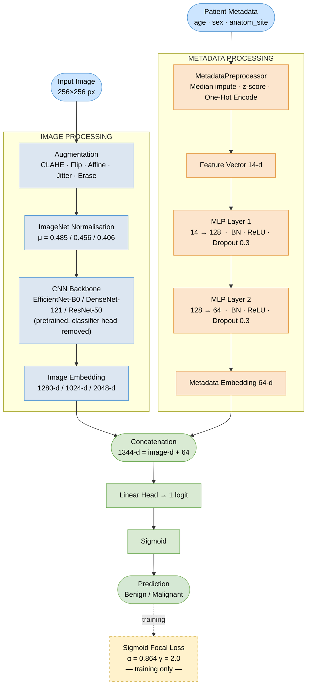

# III. Methodology

## A. Dataset

The publicly available SIIM-ISIC 2020 Melanoma Classification dataset, distributed
via the Kaggle mirror `nroman/melanoma-external-malignant-256`, is used as the
primary training source. This version supplements the 33,126 original ISIC 2020
images with externally sourced malignant examples, raising the positive class
rate to approximately **13.6%** (compared with ~1.76% in the raw challenge
split). All images are pre-resized to 256×256 pixels in JPEG format. Ground-truth
binary labels (0 = benign, 1 = malignant) are loaded from a concatenated CSV
(`train_concat.csv`).

Each sample carries three structured metadata fields sourced from the original
clinical records:
- `age_approx`: patient age rounded to the nearest five years (continuous)
- `sex`: biological sex as recorded at examination (binary categorical)
- `anatom_site_general_challenge`: coarse anatomical location from six nominal
  categories (head/neck, upper extremity, lower extremity, torso, palms/soles,
  oral/genital)

An 80/20 stratified random split with seed 42 is applied to produce training and
validation sets, preserving the positive class ratio in both partitions.

## B. Data Preprocessing and Augmentation

**Image branch — training.** A two-stage augmentation pipeline is applied:
an Albumentations stage (CLAHE clip-limit 2.0, stochastic Gaussian/Median blur,
90° snap rotations) followed by a torchvision v2 stage (random horizontal/vertical
flip, random affine ±15°, colour jitter, random erasing, ImageNet normalisation
μ=[0.485, 0.456, 0.406]). Heavy augmentation is critical for preventing
over-fitting on the minority class [8].

**Image branch — validation.** Resize and ImageNet normalisation only.

**Metadata branch.** A custom `MetadataPreprocessor` (fit on training data
only) applies median imputation and z-score normalisation for `age_approx`,
and mode imputation with one-hot encoding for categorical fields. The resulting
feature vector has **14 dimensions**.

## C. Model Architecture

A dual-branch late-fusion model (`MetadataMelanomaModel`) is implemented in
PyTorch. The design follows the late-fusion paradigm found in top ISIC 2020
systems [8] and validated on skin lesion metadata datasets [14].

**Image branch.** A torchvision pretrained backbone has its final classification
head replaced with `nn.Identity`, exposing the global average-pooled feature
vector. Output dimensionalities are: EfficientNet-B0 → 1280 d, DenseNet-121 →
1024 d, ResNet-50 → 2048 d. All backbone weights are initialised from
ImageNet-1k pretrained checkpoints and are fully fine-tuned.

**Metadata branch.** A two-layer MLP implemented with `torchvision.ops.MLP`
(Linear → BatchNorm1d → ReLU → Dropout(0.3), repeated across hidden dimensions
[128, 64]) maps the 14-dimensional clinical feature vector to a compact
**64-dimensional** embedding. Batch normalisation and dropout serve as
regularisers, preventing the metadata branch from over-fitting the small
numerical/categorical signal.

**Fusion head.** The image embedding and metadata embedding are concatenated
along the feature dimension and passed through a single linear projection to
one output logit. A sigmoid activation converts this logit to a probability at
inference time.

Fig. 1 illustrates the full dual-branch pipeline.

*Fig. 1: Dual-branch metadata-fusion pipeline. The image branch extracts a CNN
embedding; the metadata branch encodes clinical fields through a two-layer MLP.
Both embeddings are concatenated and projected to a single malignancy logit.*

## D. Loss Function and Training Configuration

Sigmoid focal loss [13] is used to address the 6.4:1 class imbalance:

$$FL(p_t) = -\alpha_t (1 - p_t)^\gamma \log(p_t)$$

where $\alpha = 0.864$ (set to $1 - 0.136$, the inverse malignant class
proportion) up-weights positive examples, and $\gamma = 2.0$ down-weights easy
negatives so that gradient signal concentrates on hard or ambiguous malignant
samples.

| Hyperparameter    | Value              |
|-------------------|--------------------|
| Optimiser         | Adam               |
| Learning rate     | 1 × 10⁻⁴ (fixed)  |
| Batch size        | 32                 |
| Epochs            | 20                 |
| Loss              | Sigmoid focal loss |
| Focal α           | 0.864              |
| Focal γ           | 2.0                |
| Train/val split   | 80 / 20 (stratified) |
| Random seed       | 42                 |

All models are trained using the Adam optimiser at a fixed learning rate of
1×10⁻⁴ with no learning-rate scheduling. The model checkpoint achieving the
highest validation F1 score across all epochs is retained as the best model
for each backbone.

## E. Test-Time Augmentation

TTA reduces prediction variance at inference by averaging model outputs across
multiple transformed versions of the same input image without any additional
training. Two strategies are implemented:

**Basic TTA** averages the sigmoid probabilities from the original image and
its horizontal flip. This provides a modest variance reduction with negligible
computational overhead (2× inference cost).

**Comprehensive TTA** averages probabilities across six geometric transforms:
original, horizontal flip, vertical flip, 90° rotation, 180° rotation, and
270° rotation. This yields more conservative probability estimates and is
particularly beneficial for lesions that appear near a decision boundary, such
as small or amelanotic melanomas [17]. Comprehensive TTA incurs 6× inference
cost and is therefore optional at deployment time.

In the experiments reported in Section IV, TTA is disabled by default (to
isolate backbone-level differences) but its impact is evaluated in a dedicated
comparison (Section IV-D).

## F. Evaluation Protocol

Models are evaluated on the held-out validation split using accuracy, recall
(sensitivity), specificity, PPV, and F1. Recall is the primary safety-critical
metric: a missed melanoma carries a higher clinical cost than a false positive.
Best-checkpoint (max validation F1) and final-epoch metrics are both reported
to capture peak performance and training stability.

---

[← II. Literature Review](03_literature_review.md) | [Next → IV. Experiments](05_experiments.md)
